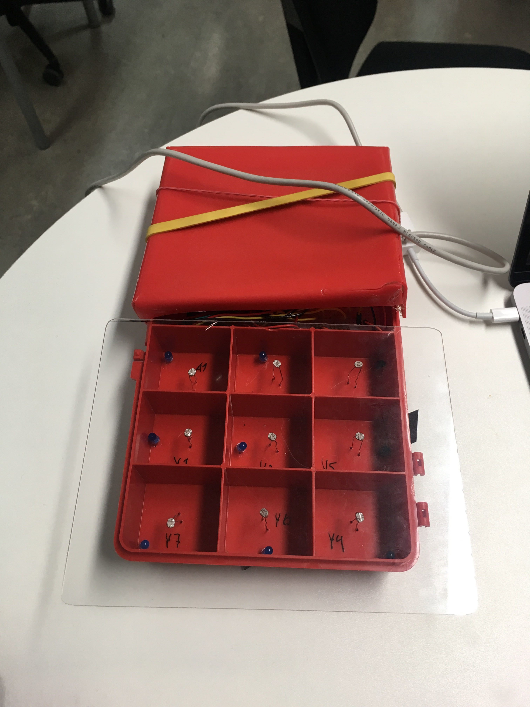
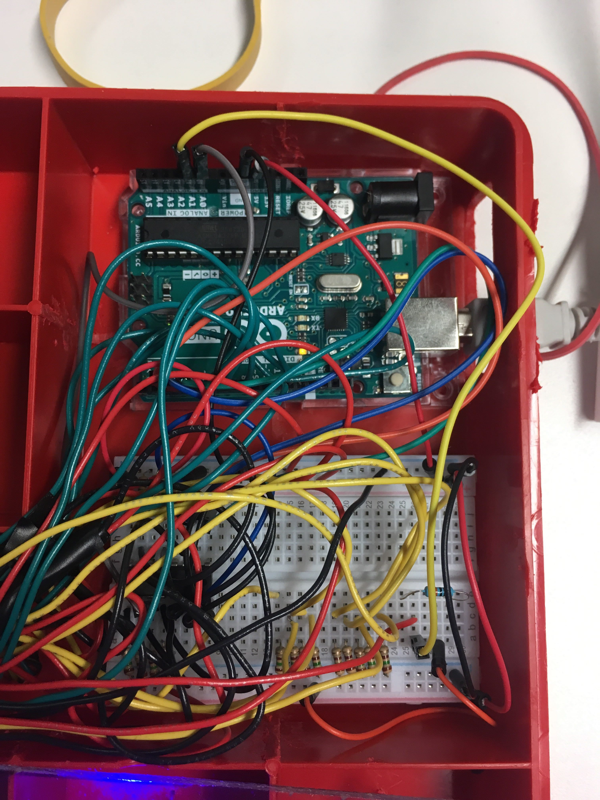

## TicTacToeBeta
#### Audrino Project

Collaborators:
 - [Laureta Dzika](https://github.com/xhika)
 - [Sofia Garcia](https://github.com/sof1agarc1a)

In this project we are using the multiplexer 74HC4051 to be able to read analog inputs from 9 different light sensors.

Data sheet:
[https://assets.nexperia.com/documents/data-sheet/74HC_HCT4051.pdf](https://assets.nexperia.com/documents/data-sheet/74HC_HCT4051.pdf)

(PIN 6,7,8 are all connected to ground)